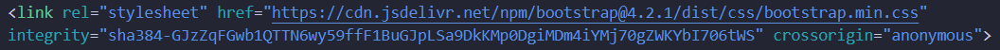
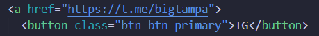
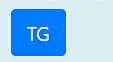
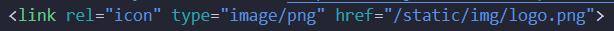
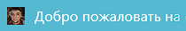
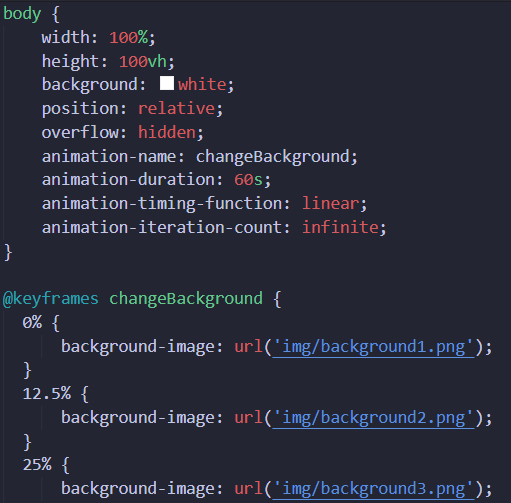
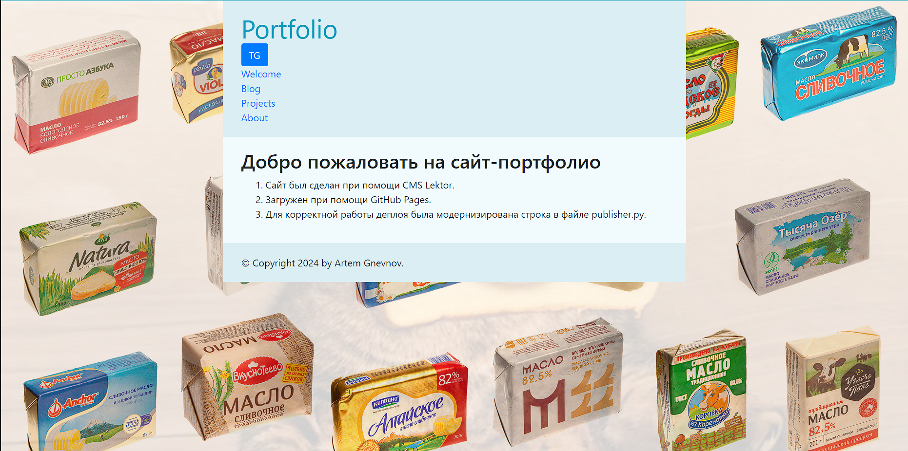

1. Загружаем css стиль в основной файл layout.html:

2. Создаём в layout.html кнопку для перехода на telegram автора при помощи css, добавленным ранее:
 

3. Оформляем иконку сайта. Создаём по пути assets/static папку img, в которую загружаем png изображание с названием logo:

4. Создаём обои для сайта. В созданную раннее папку img закидываем 3 изображения, из которых будут создаваться анимированые обои для сайта: 

program fqm;
var a,b,c: integer;
begin
a:=3;
b:=5;
c:=a+b;
writeln(c);
end.
